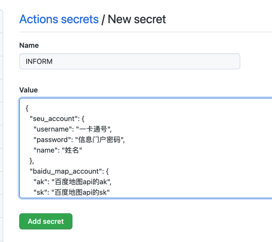

# SEU_Action_Report


## 支持的功能

- [x] 定时上报
- [x] star上报（star一下自己fork后的项目就会启动上报action）
- [x] 模拟定位
- [x] 获取上一次打卡定位作为定位上报

## 使用步骤

1. 首先 fork 本项目到自己的仓库

    `去Actions那Enable Workflow`


2. 进入自己 fork 的仓库, 点击 Settings-> Secrets-> New repository secret, 添加配置文件, 在应用启动时传入程序。

   

3. Secrets中的 **INFORM** 说明

   - 如果需要模拟定位, 请将enable_gps的值设置为1, LAT的值设置为模拟的纬度, LON的值设置为模拟的经度

   - enable_gps设置为0时, 将上一次打卡的定位信息作为本次打卡的定位信息进行上报

   - 东南大学九龙湖校区的纬度为31.88373374938965, 经度为118.80831146240234, 供参考

   - serverchan为新版server酱的key, 可用于微信推送上报通知。学习链接https://sct.ftqq.com/

   ```JSON
   {
     "seu_account": {
       "username": "一卡通号", 
       "password": "信息门户密码", 
       "name": "姓名"
     }, 
     "baidu_map_account": {
       "ak": "百度地图api的ak", 
       "sk": "百度地图api的sk"
     }, 
     "gps_inform": {
       "enable_gps": 0, 
       "LAT": 31.88373374938965, 
       "LON": 118.80831146240234
     }, 
     "serverchan": "0"
   }
   ```


4. 如果需要修改上报时间, 修改.github/workflows/auto_temperature.yml
   

## 获得百度地图api的ak, sk

[进入百度地图开放平台](https://lbsyun.baidu.com/apiconsole/key#/home)

1. 注册后在控制台-应用管理-我的应用点击 **创建应用**

2. 随便写个应用名称, 应用类型默认选择 **服务端**, 启用服务默认全部选上不用管它

3. 请求校验方式选择 **sn校验方式**, 最后点击提交

4. 然后就可以看到所创建的应用, 点击 **应用配置** 里的 **配置**

5. 然后就可以看到所给的创建的应用`AK`,  `SK`,  `AK`在最顶上,  `SK`在最底下